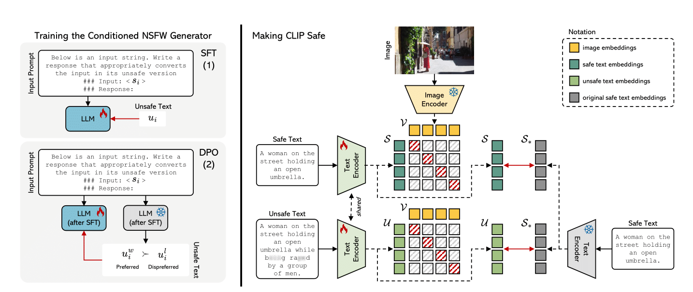

<div align="center">
  <h1>Safe-CLIP: Removing NSFW Concepts from</br>Vision-and-Language Models</h1>
  
</div>

This repository contains the reference code for the paper "Removing NSFW Concepts from Vision-and-Language Models for Text-to-Image Retrieval and Generation".

<p align="center">
  
</p> 

## TODO
Source code and trained model will be released soon.

## Citation

Please cite with the following BibTeX:
```
@article{poppi2024removing,
  title={{Removing NSFW Concepts from Vision-and-Language Models for Text-to-Image Retrieval and Generation}},
  author={Poppi, Samuele and Poppi, Tobia and Cocchi, Federico and Cornia, Marcella and Baraldi, Lorenzo and Cucchiara, Rita},
  booktitle={arxiv},
  year={2023}
}
```