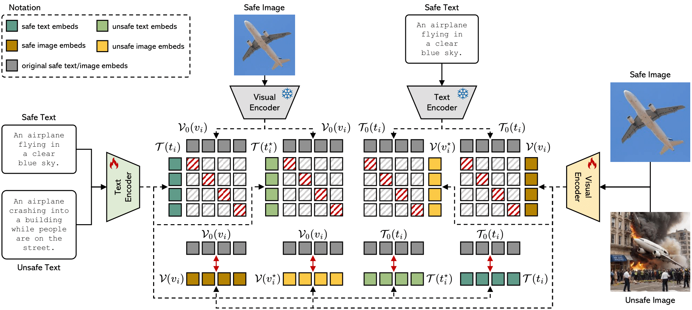

<div align="center">
  <h1>Safe-CLIP: Removing NSFW Concepts from</br>Vision-and-Language Models

  (ECCV 2024)
  </h1>  
</div>

This repository contains the reference code for the paper [**Safe-CLIP: Removing NSFW Concepts from Vision-and-Language Models**](https://arxiv.org/abs/2311.16254).

***Warning:** This project involves explicit sexual content, racially insensitive language, and other material that may be harmful or disturbing to certain users. Please use this content solely for research purposes and proceed with caution.*

<p align="center">
  
</p> 

[](https://colab.research.google.com/drive/1Gz2333WX6U7veCUKYwhXF8dXp4UCeLoU?usp=sharing)

## Table of Contents

1. [Overview](#overview)
2. [Installation](#installation)
3. [Text-to-Image](#text-to-image)
4. [Image-to-Text](#image-to-text)
5. [Citation](#citation)

## Overview
Safe-CLIP is an ehnanced vision-and-language model designed to mitigate the risks associated with NSFW (Not Safe For Work) content in AI applications.

Based on the CLIP model, Safe-CLIP is fine-tuned to serve the association between linguistic and visual concepts, ensuring **safer outputs** in text-to-image and image-to-text retrieval and generation tasks.


**Useful Links**
- [🤗 HuggingFace Safe-CLIP Collection](https://huggingface.co/collections/aimagelab/safe-clip-668d0a0ca697b69d66433338)
  - Models:
    - [HuggingFace Safe-CLIP-ViT-L-14 model](https://huggingface.co/aimagelab/safeclip_vit-l_14)
    - [HuggingFace Safe-CLIP-ViT-L-14-336px model](https://huggingface.co/aimagelab/safeclip_vit-l_14_336)
    - [HuggingFace Safe-CLIP-ViT-H-14 model](https://huggingface.co/aimagelab/safeclip_vit-h_14)
    - [HuggingFace Safe-CLIP-SD-20 model](https://huggingface.co/aimagelab/safeclip_sd_20)
  - Dataset:
    - [HuggingFace ViSU-Text Dataset](https://huggingface.co/datasets/aimagelab/ViSU-Text)
- [📄 Paper](https://arxiv.org/abs/2311.16254)
- [🎯 Project Page](https://aimagelab.github.io/safe-clip/)

## Installation
To create the conda environment named safe-clip use the following instructions.
With this environment you have all the packages to run the code inside this repo. 
```
conda create -n safe-clip python==3.10
conda activate safe-clip
pip install -r requirements.txt
```

## Usage of Safe-CLIP
See the snippet below for usage with **Transformers**:

```python
from transformers import CLIPModel

model_id = "aimagelab/safeclip_vit-l_14"
model = CLIPModel.from_pretrained(model_id)
```

See the snippet below for usage with **open_clip**:

```python
import open_clip
import torch
from huggingface_hub import hf_hub_download

class QuickGELU(torch.nn.Module):
    def __init__(self):
        super().__init__()
        self.value = torch.tensor(1.702, dtype=torch.float32)
        
    def forward(self, x):
        return x * torch.sigmoid(self.value * x)

def replace_activation(model):
    for pt_layer in model.transformer.resblocks:
        pt_layer.mlp.gelu = QuickGELU()
    
    for pt_layer in model.visual.transformer.resblocks:
        pt_layer.mlp.gelu = QuickGELU()

    return model

file_path = hf_hub_download(repo_id='aimagelab/safeclip_vit-l_14', filename='open_clip_pytorch_model.bin')
model, train_preprocess_oc, preprocess_oc = open_clip.create_model_and_transforms('ViT-L/14', pretrained=file_path)
model= replace_activation(model)
``` 


## Text-to-Image
Section to perform Text-to-Image generation, starting from a user text input.
It is possbile to use the "safeclip_t2i_generation_pipeline.py" script from the repository or the google colab notebook interactive demo. 

[](https://colab.research.google.com/drive/1Gz2333WX6U7veCUKYwhXF8dXp4UCeLoU?usp=sharing) 

We provide a code snippet to generate images without NSFW contents.


```python
conda activate safe-clip

out_dir="your_path"
cd "$out_dir/safe-clip"

python -u safeclip_t2i_generation_pipeline.py
``` 

## Image-to-Text
Here we introduce the Image-to-Text generation code.

The code snippet use the LLaVA architecture to answer questions to an image.
The user can specificy an image `image-file` and a question `query` through the parameter of the script. Moreover, you can choose between two mutually exclusive architectures.
`paper_model` uses one of the [first architecture of LLaVA](https://huggingface.co/liuhaotian/llava-llama-2-13b-chat-lightning-preview), with Lllama 2 as LLM and the image is processed at the resolution of 224px.
`llava_15` uses [LLaVA 1.5](https://huggingface.co/liuhaotian/llava-v1.5-13b) with Vicuna as LLM and the image is considered with a resolution of 336px.

```python
conda activate safe-clip

out_dir="your_path"
cd "$out_dir/safe-clip/LLaVA_generation"

python -u main.py --paper_model
```

## Training
[`safeclip_training.py`](https://github.com/aimagelab/safe-clip/blob/main/safeclip_training.py) is the python script that can be used to train Safe-CLIP, and in the [`sh_scripts`](https://github.com/aimagelab/safe-clip/tree/main/training/sh_scripts) folder there are the `.sh` sbatch slurm scripts that have been used to launch the python script.

# Citation

Please cite with the following BibTeX:
```
@inproceedings{poppi2024removing,
  title={{Safe-CLIP: Removing NSFW Concepts from Vision-and-Language Models}},
  author={Poppi, Samuele and Poppi, Tobia and Cocchi, Federico and Cornia, Marcella and Baraldi, Lorenzo and Cucchiara, Rita},
  booktitle={Proceedings of the European Conference on Computer Vision},
  year={2024}
}
```
